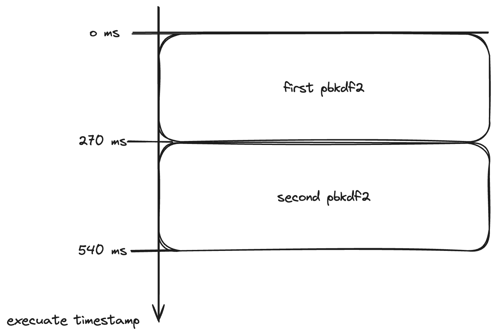
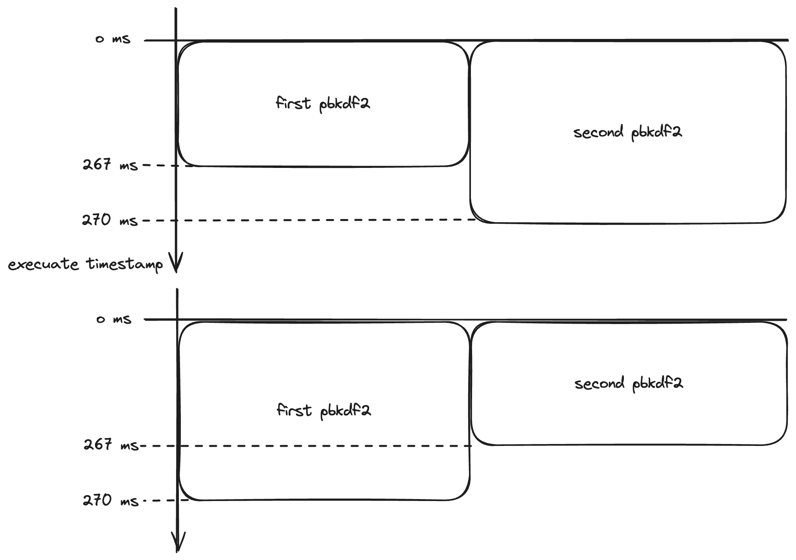
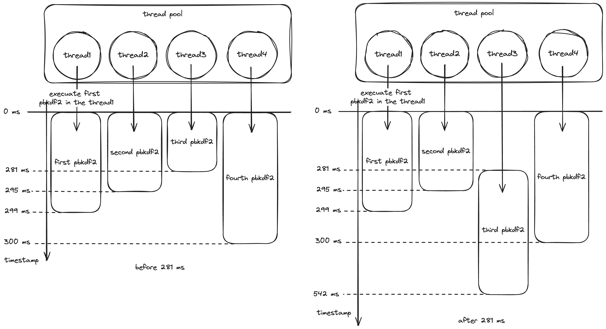
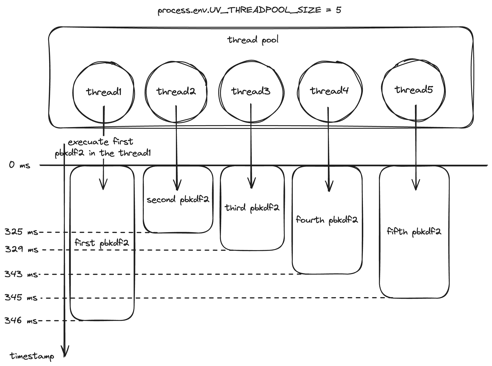

# node-deep-thinking-note
这个仓库用来记录对node的架构上的细节的理解，可以解决市面上大多数的疑惑，也可以纠正市面上大多数的错误

> 写在前面，这个项目只是从现象上说明node的一些细节，但是绝对不能代替阅读node源码

# 通过pbkdf2这个node的内置库crypto的函数，理解node如何使用v8和libuv

# 通过pbkdf2了解node的libuv线程池工作
默认node的libuv的线程池中会有四个线程
## 当我们使用了一个pbkdf2函数
```js
const crypto = require('crypto')

const start = Date.now()

crypto.pbkdf2('a', 'b', 100000, 512, 'sha512', () => {
    console.log(`1: ${Date.now() - start}ms`)
})
```
命令行打印的消耗时间为
```sh
1: 250ms
```
接下来我们将以这个时间作为参照值来看后面的调用
## 当我们使用了两个pbkdf2函数
```js
const crypto = require('crypto')

const start = Date.now()

crypto.pbkdf2('a', 'b', 100000, 512, 'sha512', () => {
    console.log(`1: ${Date.now() - start}ms`)
})

crypto.pbkdf2('a', 'b', 100000, 512, 'sha512', () => {
    console.log(`2: ${Date.now() - start}ms`)
})
```
命令行打印的消耗时间为
```sh
2: 267ms
1: 270ms
```
对于只使用了一个pbkdf2的情况，我们可以看出使用两个pbkdf2并不会让第二个pbkdf2的时间变成两倍，可以认为使用两个pbkdf2不会增加整篇代码的执行时间
而且我们可以看到一个偶然的显现就是2号pbkdf2的执行消耗时间比1号的执行消耗时间还要短，其实从量级上来说相差不大，可以认为他们是同时执行结束的
从这个例子就可以看出，这两个pbkdf2函数是并发执行的，他们同时使用了libuv中的两个线程
* 如果node是单线程，两个pbkdf2执行的时间图应该是

* 如果node是多线程的话，两个pbkdf2执行的时间图就会有两种可能了

这也是上面为什么会出现2号pbkdf2在1号pbkdf2之前完成的现象的原因了
## 当我们使用了四个pbkdf2函数
```js
const crypto = require('crypto')

const start = Date.now()

crypto.pbkdf2('a', 'b', 100000, 512, 'sha512', () => {
    console.log(`1: ${Date.now() - start}ms`)
})

crypto.pbkdf2('a', 'b', 100000, 512, 'sha512', () => {
    console.log(`2: ${Date.now() - start}ms`)
})

crypto.pbkdf2('a', 'b', 100000, 512, 'sha512', () => {
    console.log(`3: ${Date.now() - start}ms`)
})

crypto.pbkdf2('a', 'b', 100000, 512, 'sha512', () => {
    console.log(`4: ${Date.now() - start}ms`)
})
```
命令行打印的消耗时间为
```sh
3: 286ms
1: 296ms
2: 307ms
4: 307ms
```
可以看到四个pbkdf2函数依旧是并发执行
## 当我们使用了五个pbkdf2函数
```js
const crypto = require('crypto')

const start = Date.now()

crypto.pbkdf2('a', 'b', 100000, 512, 'sha512', () => {
    console.log(`1: ${Date.now() - start}ms`)
})

crypto.pbkdf2('a', 'b', 100000, 512, 'sha512', () => {
    console.log(`2: ${Date.now() - start}ms`)
})

crypto.pbkdf2('a', 'b', 100000, 512, 'sha512', () => {
    console.log(`3: ${Date.now() - start}ms`)
})

crypto.pbkdf2('a', 'b', 100000, 512, 'sha512', () => {
    console.log(`4: ${Date.now() - start}ms`)
})

crypto.pbkdf2('a', 'b', 100000, 512, 'sha512', () => {
    console.log(`5: ${Date.now() - start}ms`)
})
```
命令行打印的消耗时间为
```sh
3: 281ms
2: 295ms
1: 299ms
4: 300ms
5: 542ms
```
这时我们可以看到5号pbkdf2函数的执行时间变成了前面四个pbkdf2函数的两倍，原因是什么呢？
libuv底层的线程池中默认只有四个线程，如果我们只是注册四个pbkdf2，那么这四个pbkdf2会被分别分配给四个线程，每个线程执行一个pbkdf2函数
由于操作系统的公平调度能力，所以每个线程的分到的可用的时间片都是相同的，所以这个四个线程中的pbkdf2函数会几乎同时执行结束，且执行相同的时间
但是这里有五个pbkdf2函数，那怎么分配呢？
首先，前四个pbkdf2函数会依旧使用每个线程分配一个的模式，然后这四个线程还是会被操作系统公平调度
直到这四个线程中有一个线程执行完了它的pbkdf2函数，这个时候这个线程就空闲了，libuv会从线程池中取出这个空闲的线程分配给第五个pbkdf2函数
所以这第五个pbkdf2函数一定会最后执行，前面四个pbkdf2函数的执行结束的顺序可能会变，但是这第五个一定是最后一个执行的且是最后一个执行完毕的
用时间图来描述的话就是下面的情况

## 更改libuv线程池中线程的数量为5个
```js
process.env.UV_THREADPOOL_SIZE = 5

const crypto = require('crypto')

const start = Date.now()

crypto.pbkdf2('a', 'b', 100000, 512, 'sha512', () => {
    console.log(`1: ${Date.now() - start}ms`)
})

crypto.pbkdf2('a', 'b', 100000, 512, 'sha512', () => {
    console.log(`2: ${Date.now() - start}ms`)
})

crypto.pbkdf2('a', 'b', 100000, 512, 'sha512', () => {
    console.log(`3: ${Date.now() - start}ms`)
})

crypto.pbkdf2('a', 'b', 100000, 512, 'sha512', () => {
    console.log(`4: ${Date.now() - start}ms`)
})

crypto.pbkdf2('a', 'b', 100000, 512, 'sha512', () => {
    console.log(`5: ${Date.now() - start}ms`)
})
```
命令行打印的消耗时间为
```sh
2: 325ms
3: 329ms
4: 343ms
5: 345ms
1: 346ms
```
我们把libuv中线程池的数量改成了，通过5个pbkdf2的执行时间可以看出，这五个pbkdf2函数被分配到了libuv中的5个线程上，在操作系统的公平调度下，这5个线程并发处理自己线程中的pbkdf2函数代码，几乎同时的处理完毕
用时间图来描述一下

## 在libuv线程池中线程的数量为5个的情况下开启6个pbkdf2函数
```js
process.env.UV_THREADPOOL_SIZE = 5

const crypto = require('crypto')

const start = Date.now()

crypto.pbkdf2('a', 'b', 100000, 512, 'sha512', () => {
    console.log(`1: ${Date.now() - start}ms`)
})

crypto.pbkdf2('a', 'b', 100000, 512, 'sha512', () => {
    console.log(`2: ${Date.now() - start}ms`)
})

crypto.pbkdf2('a', 'b', 100000, 512, 'sha512', () => {
    console.log(`3: ${Date.now() - start}ms`)
})

crypto.pbkdf2('a', 'b', 100000, 512, 'sha512', () => {
    console.log(`4: ${Date.now() - start}ms`)
})

crypto.pbkdf2('a', 'b', 100000, 512, 'sha512', () => {
    console.log(`5: ${Date.now() - start}ms`)
})

crypto.pbkdf2('a', 'b', 100000, 512, 'sha512', () => {
    console.log(`6: ${Date.now() - start}ms`)
})
```
命令行打印的消耗时间为
```sh
4: 337ms
3: 349ms
5: 349ms
2: 349ms
1: 357ms
6: 592ms
```
我们可以看到，"在libuv线程池中线程的数量为5个的情况下开启6个pbkdf2函数"和"在libuv线程池中线程的数量为4个(默认)的情况下开启5个pbkdf2函数"的效果如出一辙，基本上可以使用之前的解析来解释这个现象
# node中的socketI/O(网络I/O)
对于一个node程序来说，网络I/O使用的是单线程的epoll

# node中的磁盘I/O或者加密计算
node会使用libuv中的提供的线程池中的线程来处理

# 数据库访问属于socketI/O

